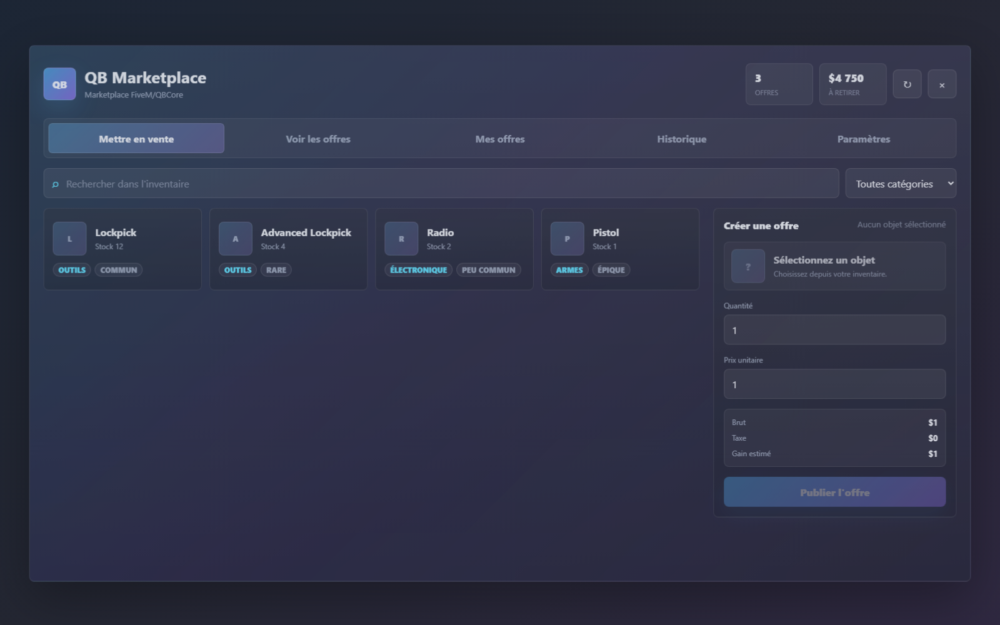

# qb-marketplace-community


Open-source FiveM/QBCore marketplace by Lens931. Built to feel like a premium paid resource while staying readable, configurable, secure and easy to fork.



## Why It Stands Out

`qb-marketplace-community` is not a quick NUI menu. It is a full marketplace product surface:

- Transparent glass UI that keeps the game visible. No heavy black rectangle behind the interface.
- Large responsive marketplace panel for 1080p and 1440p servers.
- Sell, browse, manage listings, sales history and settings in one clean app.
- Search, category filters, price/date sorting, item cards, empty states, confirmations, toasts, loaders and skeletons.
- FR/EN locale system for Lua and NUI through `Config.Locale`.
- Server-first security: the NUI is never trusted.
- Clean project structure for contributors and future adapters.

## Feature Set

### Player UX

- Publish inventory items as marketplace listings.
- Browse all active offers with search, filters and sorting.
- Buy partial quantities from a listing.
- Cancel your own active or expired listings and recover remaining items.
- Track seller history and withdraw completed sale earnings.
- Optional seller display.
- Item category and rarity badges.
- Themes: `purple`, `blue`, `dark`.

### Economy Controls

- Configurable currency.
- Configurable buyer account: `cash` or `bank`.
- Configurable seller payout account.
- Configurable marketplace tax.
- Configurable price and quantity limits.
- Configurable listing expiration.
- Blacklisted item list.
- Optional own-listing purchase protection.

### Admin & Ops

- Discord logs for listing creation, purchase, cancel and withdrawal.
- Admin cleanup command.
- SQL indexes for common listing/history queries.
- oxmysql transactions for critical updates.
- Client idle design: no permanent client thread.

## Requirements

- `qb-core`
- `qb-inventory`
- `oxmysql`

## Installation

1. Put the resource in your server, for example:

```text
resources/[qb]/qb-marketplace-community
```

2. Import the database:

```sql
source sql/install.sql;
```

3. Ensure dependencies before the marketplace:

```cfg
ensure oxmysql
ensure qb-core
ensure qb-inventory
ensure qb-marketplace-community
```

4. Configure [shared/config.lua](shared/config.lua).
5. Open in game with `/marketplace` or the configured keybind.

## Configuration Highlights

All core behavior lives in [shared/config.lua](shared/config.lua).

```lua
Config.Locale = 'fr'

Config.UI = {
    title = 'QB Marketplace',
    subtitle = 'Community exchange',
    theme = 'purple',
    currency = '$',
    showSeller = true
}

Config.Taxes = {
    enabled = true,
    percentage = 5,
    round = 'floor'
}
```

You can configure:

- title, subtitle, theme and currency;
- cash/bank accounts;
- taxes and rounding;
- expiration and cleanup retention;
- item blacklist;
- price and quantity limits;
- keybind and command;
- Discord logs;
- item categories and rarity badges.

## Security Model

The browser UI is treated as untrusted. The server always:

- validates item names, quantities and prices;
- checks blacklist and item existence;
- verifies player inventory before listing;
- verifies buyer funds before purchase;
- recalculates total price, tax and net payout;
- protects against double-clicks with rate limits and locks;
- prevents own-listing purchases when configured;
- uses oxmysql transactions for listing purchases and withdrawals.

## Performance

- No permanent client loop.
- NUI opens only on command/keybind/event.
- Server cleanup uses a scheduled timeout, not a tight thread.
- SQL tables include indexes for active listing and seller-history access.

## Locales

Lua locales:

- [locales/fr.lua](locales/fr.lua)
- [locales/en.lua](locales/en.lua)

NUI locales:

- [client/nui/locales.js](client/nui/locales.js)

Set:

```lua
Config.Locale = 'fr' -- or 'en'
```

## Database

[sql/install.sql](sql/install.sql) creates:

- `marketplace_listings`
- `marketplace_sales`

Sales are kept independent from listing cleanup so seller history remains available.

## Screenshots

The README preview is generated from the built-in NUI demo mode. In game, the demo background is not used; the UI renders over the player camera.

To regenerate a local preview:

```powershell
chrome --headless --disable-gpu --window-size=1440,900 --screenshot=docs/screenshots/marketplace-preview.png client/nui/index.html?demo=1
```

## Roadmap

- `ox_inventory` adapter.
- Server-side pagination for very large economies.
- Optional listing fee.
- Admin audit dashboard.
- More marketplace analytics.
- More locale packs from contributors.

- ## Framework Support Roadmap

Current version targets QBCore/qb-inventory.

Planned adapters:
- Qbox
- ox_inventory
- optional standalone bridge layer

The goal is to keep the marketplace core independent from framework-specific inventory, player and money APIs.

## Contributing

Good PRs are welcome. Please read [CONTRIBUTING.md](CONTRIBUTING.md) before opening a pull request.

Useful contributions:

- translations;
- inventory adapters;
- bug fixes with reproduction steps;
- UI polish that keeps the transparent in-game look;
- security hardening.

## Star The Project

If this resource saves you time or ships on your server, a GitHub star helps more people find it. It also helps prioritize future adapters and locale packs.

## License

MIT License. Credit is appreciated. Please keep the original copyright notice when redistributing.
